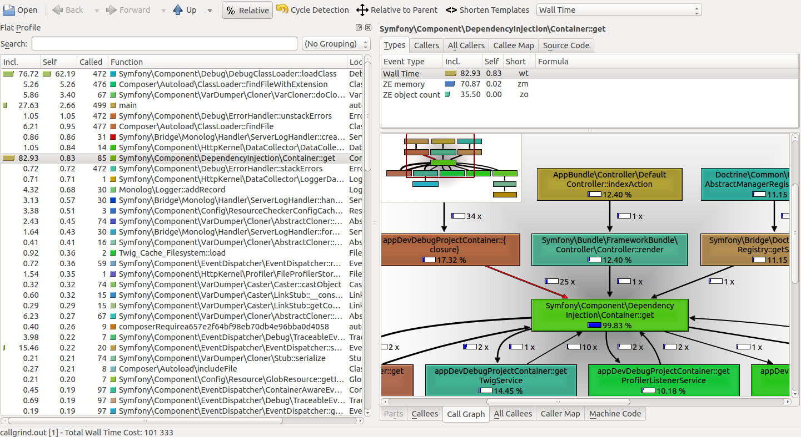
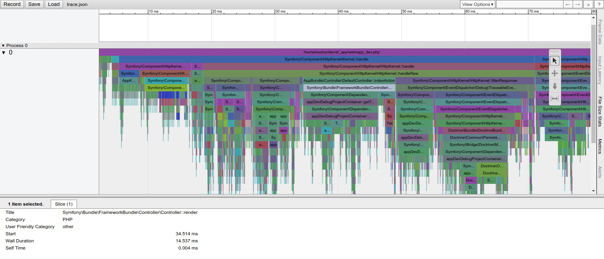

# SPX

SPX, which stands for _Simple Profiling eXtension_, is just another profiling extension for PHP.  
It differentiates itself from other similar extensions as being:
* totally free and confined to your infrastructure (i.e. no data leaks to a SaaS).
* very simple to use: just set an environment variable (command line script) or a query string parameter (web page) to get a flat profile as output. Thus, you are free of:
  * manually instrumenting your code (Ctrl-C a long running script is even supported as icing on the cake).
  * using a dedicated browser extension.
  * using a dedicated analysis tool.
* [multi metrics](#available-metrics) capable: 10 currently supported (various time metrics, memory, objects in use, I/O...).
* [multi output formats](#available-outputs) capable: SPX does not require external / third party analysis tool as it can produce flat profile, which is sufficient in most cases, on its own. However, when you need to perform deeper analysis, SPX can output profile data in the following **interoperable** formats:
  * Google's [Trace Event Format](https://docs.google.com/document/d/1CvAClvFfyA5R-PhYUmn5OOQtYMH4h6I0nSsKchNAySU/preview) to be analyzed with Chromium's / Chrome's [about:tracing](https://www.chromium.org/developers/how-tos/trace-event-profiling-tool).
  * [Callgrind format](http://valgrind.org/docs/manual/cl-format.html) to be analyzed with [KCachegrind](https://kcachegrind.github.io/html/Home.html) or similar.

## Requirements

This extension was primarily developed for my own usage and currently only fit my personal requirements:

* x86-64
* GNU/Linux (2.6+ I guess)
* zlib dev package (e.g. zlib1g-dev on Debian based distro)
* PHP 5.6 & 7+
* Non-ZTS (threaded) build of PHP (ZTS support is theoretical)

Feel free to make a PR or open an issue if your platform is not supported.

## Installation

```shell
phpize
./configure
make
make install
```

Then add `extension=spx.so` to your *php.ini*, or in a dedicated *spx.ini* file created within the include directory.  
You may also want to override [default SPX configuration](#configuration) to be able to profile HTTP requests.

## Development status

This is still **experimental**. API might change, features might be added or dropped, or development could be frozen.  
You can still safely use it in a **non-production** environment.

## Basic usage

### CLI script

Just prepend your command line with `SPX_ENABLED=1` to trigger profiling. You will get flat profile printed on STDOUT at the end of the execution, even if you abort it by hitting Ctrl-C, as in the following example:

```shell
$ SPX_ENABLED=1 composer update
Loading composer repositories with package information
Updating dependencies (including require-dev)
^C
*** SPX Report ***

Global stats:

  Called functions    :    19.2M
  Distinct functions  :      726

  Wall Time           :   24.14s
  ZE memory           :  506.3MB

Flat profile:

 Wall Time           | ZE memory           |
 Inc.     | *Exc.    | Inc.     | Exc.     | Called   | Function
----------+----------+----------+----------+----------+----------
    9.07s |    9.05s |   59.3MB |   59.0MB |       80 | Composer\Util\RemoteFilesystem::get
    3.23s |    3.23s |    9.8KB |    9.8KB |      108 | Composer\Cache::sha256
   10.48s |    1.62s |  256.3MB |  -52.2MB |      328 | Composer\DependencyResolver\RuleSetGenerator::addRulesForPackage
    2.42s |    1.15s |  100.0MB |  100.0MB |     1.2M | Composer\DependencyResolver\RuleSet::add
  760.6ms |  760.6ms |       0B |       0B |     1.2M | Composer\DependencyResolver\Rule2Literals::getHash
  726.5ms |  513.5ms |       0B |       0B |     1.2M | Composer\DependencyResolver\Rule2Literals::__construct
  544.0ms |  423.4ms |   37.1MB |   37.1MB |   470.1K | Composer\DependencyResolver\RuleWatchGraph::insert
  309.0ms |  232.2ms |       0B | -165.9MB |   470.1K | Composer\DependencyResolver\RuleWatchNode::__construct
  103.8ms |  103.8ms |       0B |       0B |   470.1K | Composer\DependencyResolver\RuleSetIterator::next
   69.3ms |   69.3ms |       0B |       0B |   470.1K | Composer\DependencyResolver\RuleSetIterator::current
```

### HTTP request

Assuming a development environment with the configuration [described here](#private-environment).  
You just have to append `SPX_KEY=dev&SPX_ENABLED=1` to the query string of your application URL to get flat profile in place of the original output, as in the following example:

```shell
$ curl 'localhost?SPX_KEY=dev&SPX_ENABLED=1'

*** SPX Report ***

Global stats:

  Called functions    :     8.9K
  Distinct functions  :     1.1K

  Wall Time           :   73.2ms
  ZE memory           :   11.3MB

Flat profile:

 Wall Time           | ZE memory           |
 Inc.     | *Exc.    | Inc.     | Exc.     | Called   | Function
----------+----------+----------+----------+----------+----------
   48.8ms |   40.8ms |    9.2MB |    9.2MB |      472 | Symfony\Component\Debug\DebugClassLoader::loadClass
    5.9ms |    3.7ms |  819.5KB |  517.1KB |       67 | Symfony\Component\VarDumper\Cloner\VarCloner::doClone
    993us |    993us |    1.6KB |    1.6KB |       31 | Symfony\Bridge\Monolog\Handler\ServerLogHandler::createSocket
    1.1ms |    905us |  724.6KB |  601.2KB |       14 | Symfony\Component\HttpKernel\DataCollector\DataCollector::serialize
    712us |    712us |  287.2KB |  287.2KB |        1 | Symfony\Component\HttpKernel\DataCollector\LoggerDataCollector::getContainerCompilerLogs
    488us |    488us |  335.5KB |  335.5KB |       16 | Symfony\Component\VarDumper\Cloner\AbstractCloner::addCasters
    1.7ms |    423us |   99.1KB | -669.6KB |        1 | Symfony\Component\HttpKernel\Profiler\FileProfilerStorage::write
    2.2ms |    310us |  302.4KB |  -63.3KB |       74 | Symfony\Component\VarDumper\Cloner\AbstractCloner::castObject
    299us |    299us |  144.1KB |  144.1KB |       74 | Symfony\Component\VarDumper\Caster\Caster::castObject
    220us |    220us |  123.4KB |  123.4KB |       74 | Symfony\Component\VarDumper\Cloner\Stub::serialize

```

See more complex examples [here](#examples).

## Advanced usage

### Parameters

#### Available parameters

| Name  | Default  | Description  |
| ----- | -------- | ------------ |
| SPX_KEY |  | The secret key, required for [HTTP request profiling](#security-concern). |
| SPX_ENABLED | 0 | Whether to enable SPX profiler (i.e. triggering profiling). When disabled there is no performance impact on your application. |
| SPX_BUILTINS | 0 | Whether to instrument internal functions. |
| SPX_DEPTH | 0 | The stack depth at which profiling must stop (i.e. aggregate measures of deeper calls). 0 (default value) means unlimited. |
| SPX_METRICS | wt,zm | Comma separated list of [available metric keys](#available-metrics) |
| SPX_OUTPUT | fp | Selected [output key](#available-outputs). |
| SPX_OUTPUT_FILE |  | CLI only. Custom output file. If not specified it will be generated in `/tmp` and displayed on STDERR at the end of the script. |
| SPX_FP_FOCUS | wt | [Metric key](#available-metrics) for flat profile sort. |
| SPX_FP_INC | 0 | Whether to sort functions by inclusive value instead of exclusive value in flat profile. |
| SPX_FP_REL | 0 | Whether to display metric values as relative (i.e. percentage) in flat profile. |
| SPX_FP_LIMIT | 10 | The flat profile size (i.e. top N shown functions). |
| SPX_FP_LIVE | 0 | For CLI only. Whether to enabled flat profile live refresh. Since it uses ANSI escape sequences, it uses STDOUT as output, replacing script output (both STDOUT & STDERR). It also does not work if you have specified a custom output file. |
| SPX_TRACE_SAFE | 0 | The trace file is by default written in a way to enforce accuracy, but in case of process crash (e.g. segfault) some logs could be lost. If you want to enforce security (e.g. to find the last event before a crash) you just have to set this parameter to 1. |

#### Setting parameters for CLI script

#### Setting parameters for HTTP request

When profiling an HTTP request, there are 2 ways to set SPX parameters:
 - as a query string parameter: `https://...?SPX_KEY=<key>`.
 - as a request header: `SPX-KEY: <key>`. Since underscores (`_`) are not allowed in header field name, you have to replace them with an en dash (`-`).

_N.B.: Query string parameters have higher precedence than request headers._

### HTTP

#### Security concern

_The lack of review / feedback about this concern is the main reason **SPX cannot yet be considered as production ready**._

SPX allows you to profile HTTP request as well as CLI scripts. In this case, and for ease of use, SPX replaces normal output by its own (as text/plain response or custom format as attachment).  
This is why there is a huge security risk, since an attacker could:
 - steal SPX output and get sensible information about your application.
 - to a lesser extent, make a DoS attack against your application with a costly SPX profiling setup.

So, unless access to your application is already restricted at lower layer (i.e. before your application is hit, not by the application / PHP framework itself), a client triggering SPX profiling must be authenticated.

SPX enforces authentication with 2 mandatory locks:
* IP address white list (exact string representation matching).
* Fixed secret random key (generated on your own) provided via a [request header or query string parameter](#http-1).

Thus a client can profile your application via an HTTP request only if **its IP address is white listed and its provided key is valid**.

#### Configuration

| Name                  | Default  | Changeable  | Description  |
| --------------------- | -------- | ----------- | ------------ |
| spx.http_enabled      | 0 | PHP_INI_SYSTEM | Whether to enable profiling of HTTP requests. |
| spx.http_key          |  | PHP_INI_SYSTEM | The secret key. You can use the following command to generate a 16 bytes random key as an hex string: `openssl rand -hex 16`. |
| spx.http_ip_var       | REMOTE_ADDR | PHP_INI_SYSTEM | The `$_SERVER` key holding the client IP address. Overriding the default value is required when your application is behind a reverse proxy. |
| spx.http_ip_whitelist |  | PHP_INI_SYSTEM | The IP address white list as a comma separated list of IP addresses. |

##### Private environment

For your local & private development environment, since there is no need for authentication, you can use this configuration:

```
spx.http_enabled=1
spx.http_key="dev"
spx.http_ip_whitelist="127.0.0.1"
```

And then trigger profiling by appending `?SPX_KEY=dev&SPX_ENABLED=1` to your application URL.

#### Best practices

 - You should prefer profiling secured (HTTPS) URLs only.
 - You should prefer set `SPX_KEY` via an HTTP header instead of a query string parameter.
 - You can take advantage of an header management browser extension for ease of use, but **do not forget to restrict SPX headers to your domain**.

### Metrics

#### Available metrics

| Key  | Name | Description |
| ---- | ---------------- | ------ |
| _wt_ | Wall Time | The absolute elapsed time. |
| _ct_ | CPU Time | The time spent while running on CPU. |
| _it_ | Idle Time | The time spent off CPU, that means waiting for CPU, I/O completion, a lock acquisition... or explicitly sleeping. |
| _zm_ | Zend Engine memory | Zend Engine memory usage. Equivalent to `memory_get_usage(false)`. |
| _zr_ | Zend Engine root buffer length | Root buffer length, see explanation [here](http://php.net/manual/en/features.gc.collecting-cycles.php). It could be helpful to track pressure on garbage collector. |
| _zo_ | Zend Engine object count | Number of objects currently held by user code. |
| _ze_ | Zend Engine error count | Number of raised PHP errors. |
| _io_ | I/O (reads + writes) | Bytes read or written while performing I/O. |
| _ior_ | I/O (reads) | Bytes read while performing I/O. |
| _iow_ | I/O (writes) | Bytes written while performing I/O. |


### Outputs

#### Available outputs

| Key  | Name  | Supported metrics  | Multi metrics  | Description  |
| ---- | ----- | ------------------ |--------------- | ------------ |
| _fp_ | Flat profile | All | Yes | The flat profile provided by SPX. It is the default output and is directly printed on STDOUT (CLI) or in place of response body (HTTP). |
| _cg_ | Callgrind | All | Yes | A file in [Callgrind format](http://valgrind.org/docs/manual/cl-format.html) to be analyzed with [KCachegrind](https://kcachegrind.github.io/html/Home.html) or similar. |
| _gte_ | Google's Trace Event Format | Time metrics | No | A file in Google's [Trace Event Format](https://docs.google.com/document/d/1CvAClvFfyA5R-PhYUmn5OOQtYMH4h6I0nSsKchNAySU/preview) to be analyzed with Chromium's / Chrome's [about:tracing](https://www.chromium.org/developers/how-tos/trace-event-profiling-tool). |
| _trace_ | Trace file | All | Yes | A custom format (human readable text) trace file. |

## Examples

### HTTP request / KCachegrind

Just run the following command:

```shell
curl --compressed 'localhost?SPX_KEY=dev&SPX_ENABLED=1&SPX_METRICS=wt,zm,zo&SPX_OUTPUT=cg' > callgrind.out
```

And then open _callgrind.out_ with KCachegrind. You will be able to explore the call-graph in many ways, over the 3 specified metrics (wt, ze & zo).




### HTTP request / about:tracing

Just run:

```shell
curl --compressed 'localhost?SPX_KEY=dev&SPX_ENABLED=1&SPX_OUTPUT=gte' > trace.json
```

And then open _trace.json_ with Chromium's / Chrome's about:tracing application to get this timeline visualization:



## Credits

I have found lot of inspiration and hints reading:
 - [XHProf](https://github.com/phacility/xhprof)
 - [Xdebug](https://github.com/xdebug/xdebug)
 - [PHP](https://github.com/php/php-src)
